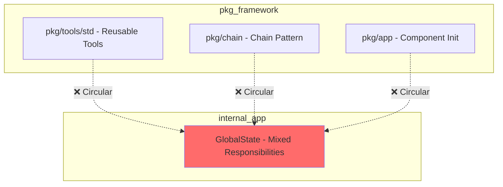

# Plan: Refactor GlobalState → pkg/state (Framework Core)

## Overview

Refactor [`GlobalState`](internal/app/state.go:32) from `internal/app` to separate **framework core** from **application-specific** logic:

- **`pkg/state/CoreState`** - Reusable e-commerce framework state (WB, S3, Ozon, LLM tools)
- **`internal/app/AppState`** - Application-specific state (TUI commands, orchestrator implementation)

## Context: Framework Purpose

**Poncho AI Framework** = Reusable e-commerce automation toolkit with:
- Wildberries API integration (Content, Feedbacks, Dictionaries)
- S3-compatible storage (PLM data, fashion sketches)
- Standard tools for product analysis, vision processing
- Future: Ozon marketplace integration

**Design Philosophy** (from [`dev_manifest.md`](dev_manifest.md)):
- **Rule 6**: `pkg/` = library code ready for reuse, `internal/` = application-specific logic
- **Rule 1**: Tool interface = "Raw In, String Out" (immutable)
- **Rule 3**: All tools registered via `Registry.Register()`
- **Rule 4**: LLM access only through `Provider` interface
- **Rule 5**: Thread-safe state access, no global variables

## Motivation

### Current Problems

1. **Circular Dependency Violation (Rule 6)**
   ```
   pkg/app/components.go  →  internal/app  ❌
   pkg/chain/chain.go     →  internal/app  ❌
   pkg/chain/react.go     →  internal/app  ❌
   ```

2. **Mixed Responsibilities** - `GlobalState` contains:
   - Framework logic (WB dictionaries, S3 client, tools registry)
   - Application logic (TUI commands, orchestrator, UI state)

3. **Limited Reusability** - Cannot use framework components independently:
   - Chain pattern requires `internal/app`
   - Tools initialization requires `internal/app`
   - Cannot create HTTP API or gRPC service without TUI dependencies

4. **Testing Difficulty** - Cannot test framework logic without UI-specific code

### Benefits of Refactoring

- ✅ **Clean Architecture** - `pkg/` no longer imports `internal/` (Rule 6)
- ✅ **Reusable Framework** - Use in CLI, TUI, HTTP API, gRPC, background workers
- ✅ **Tool Independence** - [`pkg/tools/std/`](pkg/tools/std/) already framework-agnostic
- ✅ **Chain Pattern** - Modular execution without app dependencies
- ✅ **Clear Separation** - Framework core vs application implementation

### Verified: Tools Are Already Framework-Reusable

```go
// pkg/tools/std/wb_catalog.go - typical dependencies
import (
    "github.com/ilkoid/poncho-ai/pkg/config"  // ✅ pkg/
    "github.com/ilkoid/poncho-ai/pkg/tools"   // ✅ pkg/
    "github.com/ilkoid/poncho-ai/pkg/wb"      // ✅ pkg/
)
// ❌ NO import "internal/app"
```

**Tools dependencies** (verified):
- ✅ `pkg/wb` - WB API client (framework logic)
- ✅ `pkg/s3storage` - S3 client (framework logic)
- ✅ `pkg/config` - Configuration (framework logic)
- ✅ `pkg/tools` - Tool interface (framework logic)
- ❌ NO `internal/app`, `internal/agent`, `internal/ui`

## Architecture

### Current Structure (Violates Rule 6)



### Target Structure (Rule 6 Compliant)

```mermaid
graph TB
    subgraph pkg_state_core_go
        direction TB
        A1[Config - App Configuration]
        B1[S3 Client - Storage]
        C1[Dictionaries - WB/Ozon Data]
        D1[Todo Manager - Task Planning]
        E1[Tools Registry - Framework Tools]
        F1[History - Dialog Memory]
        G1[Files - Working Memory]
        H1[sync.RWMutex - Thread Safety]
    end

    subgraph internal_app_state_go
        direction TB
        I1[CommandRegistry - TUI Commands]
        J1[Orchestrator - Agent Implementation]
        K1[UserChoice - Interactive UI]
        L1[CurrentArticleID - WB Workflow]
        M1[CurrentModel - UI State]
        N1[IsProcessing - UI Spinner]
        O1[CoreState - Embedded]
    end

    subgraph pkg_framework
        P[pkg/tools/std - Framework Tools]
        Q[pkg/chain - Chain Pattern]
        R[pkg/app - Components]
    end

    P --> E1
    Q --> A1
    R --> O1

    style O1 fill:#51cf66
    style A1 fill:#4dabf7
    style B1 fill:#4dabf7
    style C1 fill:#4dabf7
    style D1 fill:#4dabf7
    style E1 fill:#4dabf7
```



## Implementation Plan

### Phase 0: Pre-Migration Validation (NEW)

**Objective**: Verify current state and establish baseline

- [ ] Run circular dependency check:
  ```bash
  go mod graph | grep "internal/" | grep "pkg/"
  # Expected: 3 matches (components.go, chain.go, react.go)
  ```
- [ ] Verify tools are framework-independent:
  ```bash
  grep -r "internal/app" pkg/tools/std/
  # Expected: No matches
  ```
- [ ] Document current dependency graph
- [ ] Run full test suite to establish baseline

### Phase 1: Create pkg/state/CoreState

**Objective**: Extract framework core state

- [ ] Create directory `pkg/state/`
- [ ] Create file `pkg/state/core.go`
- [ ] Define `CoreState` struct with framework fields:
  ```go
  type CoreState struct {
      Config          *config.AppConfig
      S3              *s3storage.Client
      Dictionaries    *wb.Dictionaries  // Framework: e-commerce data
      Todo            *todo.Manager
      ToolsRegistry   *tools.Registry
      mu              sync.RWMutex
      History         []llm.Message
      Files           map[string][]*s3storage.FileMeta
  }
  ```
- [ ] Implement framework thread-safe methods:
  - `AppendMessage`, `GetHistory`, `ClearHistory`
  - `UpdateFileAnalysis`, `SetFiles`, `GetFiles`
  - `BuildAgentContext` (verified: uses only framework fields)
  - `AddTodoTask`, `CompleteTodoTask`, `FailTodoTask`
- [ ] Add godoc comments (Rule 10)
- [ ] Add unit tests for `CoreState` (after implementation, per Rule 9)

### Phase 2: Refactor internal/app/state.go

**Objective**: Create application-specific state

- [ ] Rename `GlobalState` to `AppState`
- [ ] Embed `*state.CoreState` (composition, not inheritance)
- [ ] Keep only application-specific fields:
  ```go
  type AppState struct {
      *state.CoreState  // Embedded framework core
      CommandRegistry   *CommandRegistry  // TUI-specific
      Orchestrator      agent.Agent       // Implementation choice
      UserChoice        *userChoiceData   // Interactive UI
      CurrentArticleID  string            // WB workflow state
      CurrentModel      string            // UI state
      IsProcessing      bool              // UI spinner
  }
  ```
- [ ] Update `NewAppState` → `state.NewCoreState()` + app-specific init
- [ ] Keep application-specific methods:
  - `SetOrchestrator`, `SetProcessing`, `GetProcessing`
  - `SetCurrentArticle`, `GetCurrentArticle`, `GetCurrentArticleID`
  - `SetUserChoice`, `GetUserChoice`, `ClearUserChoice`
  - `GetCommandRegistry`, `GetToolsRegistry` (delegates to CoreState)

### Phase 3: Break Circular Dependencies (CRITICAL)

**Objective**: Eliminate `pkg/` → `internal/` imports

#### 3a: Update pkg/chain

- [ ] Update [`pkg/chain/chain.go`](pkg/chain/chain.go:20):
  ```go
  // Before: State *app.GlobalState
  // After:  State *state.CoreState
  ```
- [ ] Update [`pkg/chain/react.go`](pkg/chain/react.go:34):
  - Change `SetState(state *app.GlobalState)` → `*state.CoreState`
  - Note: Line 249 says state is optional - verify this is still true
- [ ] Update all chain implementations (LLMInvocationStep, ToolExecutionStep)
- [ ] Verify: Chain should work with framework state only

#### 3b: Update pkg/app/components.go

- [ ] Remove import `"github.com/ilkoid/poncho-ai/internal/app"`
- [ ] Update `SetupTools` signature:
  ```go
  // Before: func SetupTools(state *app.GlobalState, ...)
  // After:  func SetupTools(state *state.CoreState, ...)
  ```
- [ ] Update `Initialize` to return `Components` with `*app.AppState`
- [ ] Update all tool registrations to use `state.CoreState` methods

#### 3c: Verify No Internal Imports in pkg/

- [ ] Run circular dependency check:
  ```bash
  go mod graph | grep "internal/" | grep "pkg/"
  # Expected: No matches (0 lines)
  ```
- [ ] If matches found, investigate and fix
- [ ] Add this check to CI/CD (if exists)

### Phase 4: Update internal/agent

**Objective**: Use AppState in agent implementation

- [ ] Update [`internal/agent/orchestrator.go`](internal/agent/orchestrator.go:24):
  ```go
  type Config struct {
      // ...
      State *app.AppState  // Changed from *app.GlobalState
  }
  ```
- [ ] Update all state access patterns (use embedded CoreState)
- [ ] Verify `pkg/agent/types.go` remains interface-only (already clean ✅)

### Phase 5: Update internal/ui

**Objective**: Use AppState in UI layer

- [ ] Update [`internal/ui/model.go`](internal/ui/model.go)
- [ ] Update [`internal/ui/update.go`](internal/ui/update.go)
- [ ] Update [`internal/ui/view.go`](internal/ui/view.go)
- [ ] All UI code uses `app.AppState` methods (delegates to CoreState where needed)

### Phase 6: Update cmd/ Applications

**Objective**: Update all entry points

**IMPORTANT**: All cmd/ utilities are verification tools for framework mechanics testing. No backward compatibility required.

- [ ] Update [`cmd/poncho/main.go`](cmd/poncho/main.go) - Primary TUI
- [ ] Update [`cmd/chain-cli/main.go`](cmd/chain-cli/main.go) - Chain pattern verification
- [ ] Update [`cmd/maxiponcho/main.go`](cmd/maxiponcho/main.go) - Fashion PLM analyzer
- [ ] Update other cmd/ utilities as needed for post-migration verification
- [ ] Verify Rule 13: Autonomous apps with local configs

### Phase 7: Testing & Validation (Rule 9)

**Objective**: Ensure no regressions

- [ ] Create CLI utility for testing state management (if needed)
- [ ] Run full test suite: `go test ./...`
- [ ] Run race detector: `go test -race ./...`
- [ ] Test all cmd/ applications manually
- [ ] Verify Rule 7: No panics in business logic

### Phase 8: Documentation Updates (Rule 10)

**Objective**: Update all documentation

- [ ] Update [`dev_manifest.md`](dev_manifest.md):
  - Rule 5: Change "GlobalState" → "CoreState + AppState"
  - Add note about framework vs application separation
- [ ] Update [`CLAUDE.md`](CLAUDE.md) architecture diagrams
- [ ] Add inline comments explaining composition pattern
- [ ] Update README if it exists

### Phase 9: Final Validation

**Objective**: Confirm success criteria met

- [ ] Final circular dependency check: `go mod graph | grep "internal/" | grep "pkg/"`
- [ ] All tests pass: `go test ./...`
- [ ] No race conditions: `go test -race ./...`
- [ ] All cmd/ apps work correctly
- [ ] Documentation complete
- [ ] Code review approved

## Field Distribution

### pkg/state/CoreState (Framework Core)

| Field | Type | Justification |
|--------|-------|---------------|
| Config | *config.AppConfig | Framework configuration (Rule 2) |
| S3 | *s3storage.Client | Framework: S3-compatible storage |
| Dictionaries | *wb.Dictionaries | **Framework: e-commerce business logic** (WB, future Ozon) |
| Todo | *todo.Manager | Framework: task planning system |
| ToolsRegistry | *tools.Registry | Framework: tool registration (Rule 3) |
| mu | sync.RWMutex | Thread safety (Rule 5) |
| History | []llm.Message | Dialog memory (framework-agnostic) |
| Files | map[string][]*s3storage.FileMeta | Working memory pattern |

**Why Dictionaries in CoreState?**
- WB dictionaries are e-commerce business logic, not app-specific
- Framework supports multiple marketplaces (WB today, Ozon tomorrow)
- Dictionary tools (`wb_colors`, `wb_countries`) are in `pkg/tools/std/`
- Reusable across CLI, TUI, HTTP API, gRPC services

### internal/app/AppState (Application-Specific)

| Field | Type | Justification |
|--------|-------|---------------|
| CoreState | *state.CoreState | Embedded framework core |
| CommandRegistry | *CommandRegistry | **TUI-specific** command handlers |
| Orchestrator | agent.Agent | Implementation choice (could use Chain instead) |
| UserChoice | *userChoiceData | **Interactive UI only** |
| CurrentArticleID | string | WB workflow state (could be in CoreState if generic) |
| CurrentModel | string | UI state display |
| IsProcessing | bool | **UI spinner only** |

## Method Distribution

### pkg/state/CoreState Methods (Framework)

```go
// Thread-safe history management
AppendMessage(msg llm.Message)
GetHistory() []llm.Message
ClearHistory()

// Thread-safe file management (Working Memory pattern)
UpdateFileAnalysis(tag, filename, description string)
SetFiles(files map[string][]*s3storage.FileMeta)
GetFiles() map[string][]*s3storage.FileMeta

// Context building (verified: uses only framework fields)
BuildAgentContext(systemPrompt string) []llm.Message

// Todo management (delegates to todo.Manager)
AddTodoTask(description string, metadata ...map[string]interface{}) int
CompleteTodoTask(id int) error
FailTodoTask(id int, reason string) error

// Registry getters
GetToolsRegistry() *tools.Registry
```

### internal/app/AppState Methods (Application)

```go
// Orchestrator management
SetOrchestrator(orch agent.Agent)
GetOrchestrator() agent.Agent

// UI-specific processing
SetProcessing(busy bool)
GetProcessing() bool

// Article management (WB workflow - could move to CoreState)
SetCurrentArticle(articleID string, files map[string][]*s3storage.FileMeta)
GetCurrentArticle() (articleID string, files map[string][]*s3storage.FileMeta)
GetCurrentArticleID() string

// User choice (interactive UI only)
SetUserChoice(question string, options []string)
GetUserChoice() (string, []string)
ClearUserChoice()

// Registry getters
GetCommandRegistry() *CommandRegistry
GetToolsRegistry() *tools.Registry  // Delegates to CoreState

// Forwarded CoreState methods (via composition)
AppendMessage(msg llm.Message)
GetHistory() []llm.Message
// ... etc
```

## Migration Guide

### Before (Circular Dependency)

```go
import "github.com/ilkoid/poncho-ai/internal/app"

state := app.NewState(cfg, s3Client)
state.AppendMessage(msg)
context := state.BuildAgentContext(systemPrompt)
```

### After: Framework-Only Application

```go
import "github.com/ilkoid/poncho-ai/pkg/state"

coreState := state.NewCoreState(cfg, s3Client)
coreState.AppendMessage(msg)
context := coreState.BuildAgentContext(systemPrompt)
```

### After: TUI Application (Current poncho)

```go
import "github.com/ilkoid/poncho-ai/internal/app"

appState := app.NewAppState(cfg, s3Client)
appState.AppendMessage(msg)        // Uses CoreState via composition
appState.SetProcessing(true)       // AppState-specific method
context := appState.BuildAgentContext(systemPrompt)
```

### After: Chain Pattern (cmd/chain-cli)

```go
import "github.com/ilkoid/poncho-ai/pkg/state"
import "github.com/ilkoid/poncho-ai/pkg/chain"

coreState := state.NewCoreState(cfg, s3Client)
reactChain := chain.NewReActChain(config)
reactChain.SetState(coreState)  // Now accepts CoreState, not AppState
```

## Testing Strategy (Rule 9)

### Phase 7: Create CLI Utility for Testing

Instead of unit tests, create `cmd/state-test/main.go`:

```go
// cmd/state-test/main.go
package main

func main() {
    // Test CoreState thread-safety
    // Test AppState composition
    // Verify no circular dependencies
}
```

### Manual Testing Checklist

- [ ] Framework compiles successfully
- [ ] `./poncho` - TUI application works (primary verification)
- [ ] `./chain-cli "show categories"` - Chain pattern works (if needed)
- [ ] `./maxiponcho` - Fashion PLM analyzer works (if needed)
- [ ] All tools execute correctly
- [ ] Thread-safety under concurrent load

**Note**: cmd/ utilities are verification tools. Update and test only those needed for post-migration verification.

## Risk Mitigation

| Risk | Probability | Impact | Mitigation |
|------|-------------|--------|------------|
| Breaking changes in dependent packages | Medium | **Medium** ⬇️ | **No backward compatibility needed** - cmd/ are verification tools only |
| Circular dependencies remain | Low | Critical | Automated check in Phase 0 and Phase 9 |
| Thread-safety issues | Low | High | Race detector in Phase 7 |
| Missing fields in migration | Low | Medium | Field-by-field comparison table |
| Performance regression | Low | Low | Benchmark before/after if needed |
| Dictionaries placement debate | Medium | Low | Documented rationale (e-commerce logic) |

**Risk Reduced**: Original assessment had HIGH impact for breaking changes. Since all cmd/ utilities are verification tools with no backward compatibility requirement, impact is reduced to MEDIUM.

## Success Criteria

### Functional Requirements

- [ ] Framework compiles: `go build ./pkg/... ./internal/...`
- [ ] No circular dependencies: `go mod graph | grep "internal/" | grep "pkg/"` returns empty
- [ ] No race conditions: `go test -race ./...` passes
- [ ] All tools work correctly with CoreState
- [ ] cmd/ utilities updated as needed for verification (no backward compatibility requirement)

### Architectural Requirements (dev_manifest.md)

- [ ] **Rule 6**: `pkg/` no longer imports `internal/`
- [ ] **Rule 5**: Thread-safe state access maintained
- [ ] **Rule 1**: Tool interface unchanged ("Raw In, String Out")
- [ ] **Rule 3**: Tools still registered via Registry
- [ ] **Rule 4**: LLM access only through Provider interface
- [ ] **Rule 7**: No panics in business logic
- [ ] **Rule 10**: All public APIs have godoc comments
- [ ] **Rule 13**: Autonomous apps with local configs

### Documentation Requirements

- [ ] [`dev_manifest.md`](dev_manifest.md) updated with CoreState/AppState
- [ ] [`CLAUDE.md`](CLAUDE.md) architecture diagrams updated
- [ ] Inline comments explain composition pattern

## Implementation Notes

### Design Decisions

1. **Composition over Inheritance**
   - `AppState` embeds `CoreState` (not extends)
   - Clear separation: framework vs application
   - Allows different implementations (e.g., HTTP API using CoreState directly)

2. **Dictionaries in CoreState**
   - Rationale: e-commerce business logic belongs in framework
   - WB dictionaries are reusable across applications
   - Future: Ozon dictionaries will follow same pattern

3. **BuildAgentContext in CoreState**
   - Verified: Uses only framework fields (Files, Todo, History)
   - Does NOT depend on Orchestrator or CommandRegistry
   - Reusable across agent implementations

4. **Chain Pattern Independence**
   - `pkg/chain` should work with `CoreState` only
   - No dependency on TUI-specific fields
   - Enables usage in CLI, HTTP API, gRPC, background workers

### Dependency Order (Critical)

```
1. pkg/state (new, no internal/ imports)
2. pkg/chain, pkg/app (update to use pkg/state)
3. internal/app (embeds pkg/state)
4. internal/agent, internal/ui (use internal/app)
5. cmd/* (entry points)
```

### CI/CD Integration (Future)

Add to automated checks:
```bash
# No circular dependencies
! go mod graph | grep "internal/" | grep "pkg/"

# No internal imports in pkg/
! find pkg/ -name "*.go" -exec grep -l "internal/" {} \;
```

## References

- [`dev_manifest.md`](dev_manifest.md) - Immutable rules (Rules 0-13)
- [`CLAUDE.md`](CLAUDE.md) - Architecture overview
- [`internal/app/state.go`](internal/app/state.go:32) - Current GlobalState
- [`pkg/tools/std/`](pkg/tools/std/) - Framework tools (already reusable)
- [`pkg/chain/chain.go`](pkg/chain/chain.go:20) - Chain pattern (needs fixing)
- [`pkg/app/components.go`](pkg/app/components.go:19) - Component initialization (needs fixing)
