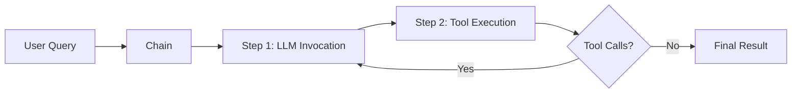
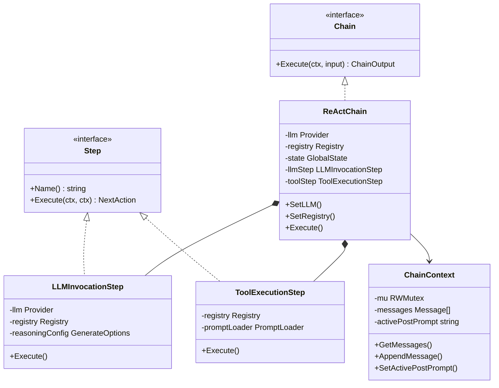
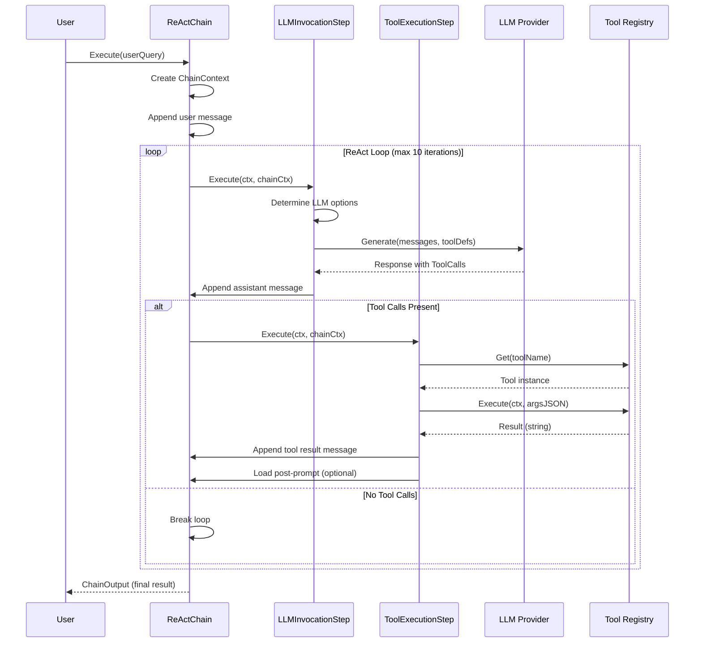
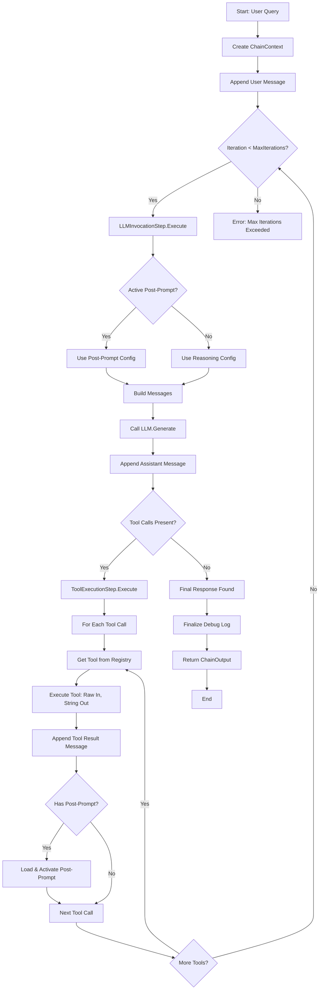
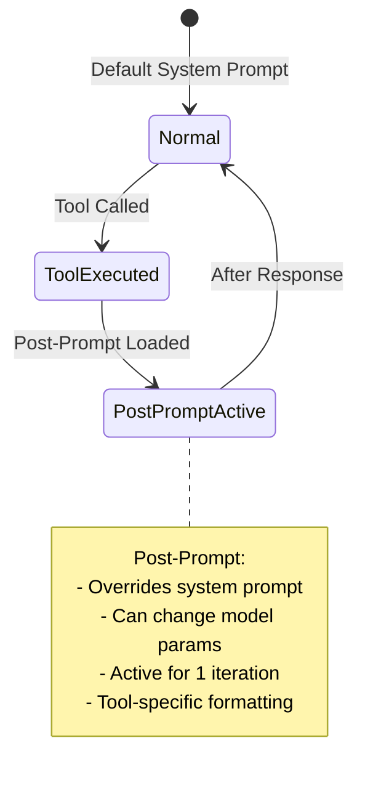

# Chain Pattern в Poncho AI: Полное Объяснение

## 1. Что такое Chain Pattern?

**Chain Pattern** (Chain of Responsibility) — это паттерн проектирования, который позволяет компоновать сложное поведение агента из простых, изолированных шагов (Steps). Каждый Step выполняет одну конкретную задачу и передаёт управление следующему.

### Ключевая идея



## 2. Архитектура Chain в Poncho AI

### Основные компоненты



## 3. Как работает ReActChain

### ReAct (Reasoning + Acting) Цикл



### Поток выполнения в деталях



## 4. Post-Prompt Механизм

Post-prompts — это мощный механизм для управления поведением агента после выполнения конкретного инструмента.

### Как это работает



### Пример конфигурации

```yaml
# prompts/tool_postprompts.yaml
tools:
  get_wb_parent_categories:
    post_prompt: "wb/parent_categories_analysis.yaml"
    enabled: true
```

```yaml
# prompts/wb/parent_categories_analysis.yaml
name: "WB Categories Analysis"
content: |
  Ты аналитик Wildberries категорий.
  
  Твоя задача:
  1. Проанализировать полученные категории
  2. Выделить ключевые метрики
  3. Представить результат в формате:
     
     ## Категории
     - Название: [name]
       ID: [id]
       Товаров: [count]
     
  Используй только данные из tool result.
config:
  model: "glm-4.6"
  temperature: 0.3
  max_tokens: 1000
```

## 5. Примеры использования для конструирования AI-агентов

### Пример 1: E-commerce Assistant

```go
// Агент для работы с Wildberries
reactChain := chain.NewReActChain(chain.ReActChainConfig{
    SystemPrompt: `Ты помощник для работы с Wildberries.`,
    ReasoningConfig: llm.GenerateOptions{
        Model:       "glm-4.6",
        Temperature: 0.5,
        MaxTokens:   2000,
    },
    ChatConfig: llm.GenerateOptions{
        Model:       "glm-4.6",
        Temperature: 0.7,
        MaxTokens:   2000,
    },
    ToolPostPrompts: toolPostPrompts,
    PromptsDir:      "./prompts",
    MaxIterations:   10,
})

// Зарегистрируем только нужные инструменты
registry := tools.NewRegistry()
registry.Register(&WbSearchTool{})
registry.Register(&WbCategoriesTool{})
registry.Register(&WbCharacteristicsTool{})

reactChain.SetLLM(llmProvider)
reactChain.SetRegistry(registry)
reactChain.SetState(state)

// Выполняем запрос
output, err := reactChain.Execute(ctx, chain.ChainInput{
    UserQuery: "Найди все товары в категории Верхняя одежда",
    State:     state,
    LLM:       llmProvider,
    Registry:  registry,
})
```

### Пример 2: Multi-Step Workflow

```go
// Агент с последовательным выполнением шагов
type WorkflowChain struct {
    steps []Step
}

func (w *WorkflowChain) Execute(ctx context.Context, input ChainInput) (ChainOutput, error) {
    chainCtx := NewChainContext(input)
    
    for _, step := range w.steps {
        action, err := step.Execute(ctx, chainCtx)
        if err != nil {
            return ChainOutput{}, err
        }
        if action == ActionBreak {
            break
        }
    }
    
    return ChainOutput{
        Result: chainCtx.GetLastMessage().Content,
    }, nil
}

// Использование
workflow := &WorkflowChain{
    steps: []Step{
        NewStepFunc("validate_input", validateInputStep),
        NewStepFunc("fetch_data", fetchDataStep),
        NewStepFunc("process_data", processDataStep),
        NewStepFunc("format_output", formatOutputStep),
    },
}
```

### Пример 3: Conditional Branching

```go
// Агент с условным ветвлением
type ConditionalChain struct {
    condition func(*ChainContext) bool
    trueBranch  Chain
    falseBranch Chain
}

func (c *ConditionalChain) Execute(ctx context.Context, input ChainInput) (ChainOutput, error) {
    chainCtx := NewChainContext(input)
    
    if c.condition(chainCtx) {
        return c.trueBranch.Execute(ctx, input)
    }
    return c.falseBranch.Execute(ctx, input)
}

// Использование
conditionalChain := &ConditionalChain{
    condition: func(ctx *ChainContext) bool {
        // Проверяем есть ли tool calls
        lastMsg := ctx.GetLastMessage()
        return len(lastMsg.ToolCalls) > 0
    },
    trueBranch: toolExecutionChain,
    falseBranch: responseChain,
}
```

### Пример 4: Parallel Tool Execution

```go
// Агент с параллельным выполнением инструментов
type ParallelToolStep struct {
    registry *tools.Registry
}

func (s *ParallelToolStep) Execute(ctx context.Context, chainCtx *ChainContext) (NextAction, error) {
    lastMsg := chainCtx.GetLastMessage()
    
    // Запускаем все tools параллельно
    var wg sync.WaitGroup
    results := make(chan ToolResult, len(lastMsg.ToolCalls))
    
    for _, tc := range lastMsg.ToolCalls {
        wg.Add(1)
        go func(tc llm.ToolCall) {
            defer wg.Done()
            result := s.executeTool(ctx, tc)
            results <- result
        }(tc)
    }
    
    wg.Wait()
    close(results)
    
    // Собираем результаты
    for result := range results {
        chainCtx.AppendMessage(llm.Message{
            Role:       llm.RoleTool,
            ToolCallID: result.ToolCallID,
            Content:    result.Result,
        })
    }
    
    return ActionContinue, nil
}
```

## 6. Преимущества Chain Pattern

### Для разработчиков

| Преимущество | Описание |
|-------------|----------|
| **Модульность** | Каждый Step — изолированный, тестируемый компонент |
| **Переиспользуемость** | Steps можно комбинировать в разных Chain |
| **Расширяемость** | Легко добавлять новые типы Steps |
| **Конфигурируемость** | YAML конфигурация без изменения кода |
| **Thread-safety** | ChainContext защищает состояние конкурентного доступа |

### Для AI-агентов

| Преимущество | Описание |
|-------------|----------|
| **Гибкость** | Легко менять поведение агента через конфигурацию |
| **Observability** | Debug логирование на каждом шаге |
| **Resilience** | Graceful error handling, no panics |
| **Tool-specific behavior** | Post-prompts для каждого инструмента |
| **Runtime control** | Динамическое изменение параметров модели |

## 7. Где это полезно для конструирования AI-агентов

### 1. **Сложные рабочие процессы**

```go
// Агент для анализа продуктов
analysisChain := chain.NewReActChain(config)
analysisChain.SetRegistry(createAnalysisTools())

// Шаги:
// 1. Загрузить данные из S3
// 2. Проанализировать изображение (Vision AI)
// 3. Получить категории из WB API
// 4. Сгенерировать описание
// 5. Сохранить результат
```

### 2. **Мультиагентные системы**

```go
// Координатор агентов
coordinator := &CoordinatorChain{
    agents: map[string]Chain{
        "search":    searchAgentChain,
        "analysis":  analysisAgentChain,
        "writer":    writerAgentChain,
    },
}

// Динамически выбирает какого агента использовать
```

### 3. **Валидация и фильтрация**

```go
// Chain с валидацией на каждом шаге
validationChain := &ValidatedChain{
    innerChain: reactChain,
    validators: []Validator{
        validateToolCalls,
        validateToolResults,
        validateLLMResponse,
    },
}
```

### 4. **A/B тестирование промптов**

```go
// Chain с переключением промптов
abTestChain := &ABTestChain{
    chainA: reactChainWithPromptA,
    chainB: reactChainWithPromptB,
    splitRatio: 0.5,
}
```

### 5. **Rate limiting и бюджетирование**

```go
// Chain с контролем расходов
budgetChain := &BudgetAwareChain{
    innerChain: reactChain,
    budget: &TokenBudget{
        MaxTokens: 100000,
        CostPerToken: 0.0001,
    },
}
```

## 8. Заключение

Chain Pattern в Poncho AI предоставляет мощную и гибкую основу для конструирования AI-агентов:

1. **Модульная архитектура** — изолированные, тестируемые Steps
2. **ReAct паттерн** — классический цикл Reasoning + Acting
3. **Post-prompts** — инструмент-специфическое поведение
4. **Thread-safety** — безопасная работа в многопоточной среде
5. **Debug интеграция** — полное наблюдение за выполнением
6. **YAML конфигурация** — без изменения кода
7. **Расширяемость** — лёгкое добавление новых типов Chains и Steps

Это делает Poncho AI отличным фреймворком для построения сложных, надёжных и наблюдаемых AI-агентов.
